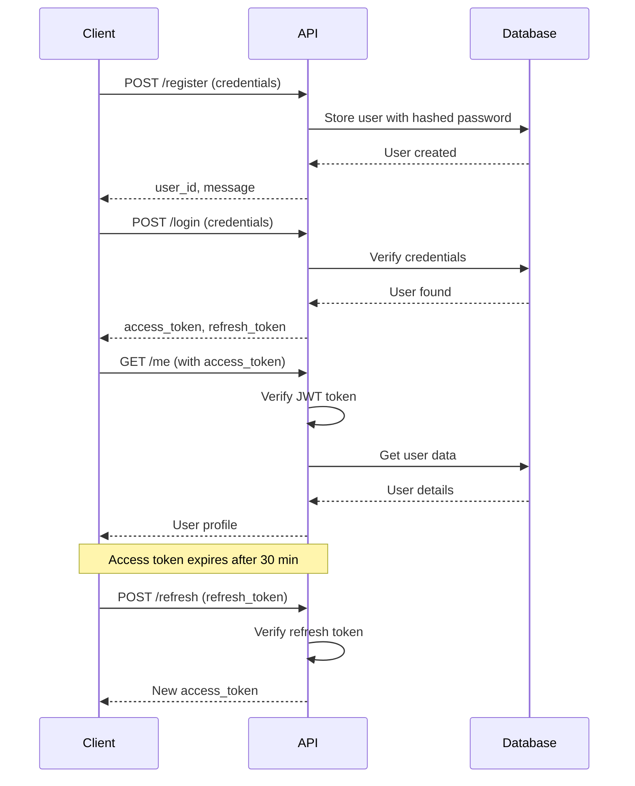

## Overview

The Expensia Finance Tracker API uses **JWT (JSON Web Tokens)** for secure authentication. The authentication system provides:

- **Access Tokens**: Short-lived tokens (30 minutes) for API requests
- **Refresh Tokens**: Long-lived tokens (7 days) to obtain new access tokens
- **Argon2 Password Hashing**: Industry-standard secure password storage
- **Bearer Token Authentication**: Standard HTTP Authorization header

<Note>
  All authentication endpoints are located at the root path (e.g., `/register`, `/login`). Protected endpoints require a valid access token in the Authorization header.
</Note>

## Authentication Flow



## Registration

Register a new user account with email validation and secure password hashing.

### Endpoint

```
POST /register
```

### Request Body

<ParamField body="name" type="string" required>
  User's full name
</ParamField>

<ParamField body="email" type="string" required>
  Valid email address (will be validated and normalized)
</ParamField>

<ParamField body="password" type="string" required>
  User password (will be hashed using Argon2)
</ParamField>

### Code Examples

<CodeGroup>
```bash cURL
curl -X POST http://localhost:8000/register \
  -H "Content-Type: application/json" \
  -d '{
    "name": "Jane Smith",
    "email": "jane.smith@example.com",
    "password": "MySecureP@ssw0rd"
  }'
```

```python Python
import requests

def register_user(name: str, email: str, password: str):
    """Register a new user account"""
    response = requests.post(
        "http://localhost:8000/register",
        json={
            "name": name,
            "email": email,
            "password": password
        }
    )
    
    if response.status_code == 200:
        data = response.json()
        print(f"User registered successfully! ID: {data['user_id']}")
        return data
    elif response.status_code == 409:
        print("Error: Email already exists")
    elif response.status_code == 400:
        print("Error: Invalid email format")
    else:
        print(f"Error: {response.json()}")
    
    return None

# Example usage
register_user("Jane Smith", "jane.smith@example.com", "MySecureP@ssw0rd")
```

```javascript JavaScript
async function registerUser(name, email, password) {
  try {
    const response = await fetch('http://localhost:8000/register', {
      method: 'POST',
      headers: {
        'Content-Type': 'application/json',
      },
      body: JSON.stringify({ name, email, password })
    });

    if (!response.ok) {
      const error = await response.json();
      throw new Error(error.detail);
    }

    const data = await response.json();
    console.log('User registered:', data);
    return data;
  } catch (error) {
    console.error('Registration failed:', error.message);
    throw error;
  }
}

// Example usage
await registerUser('Jane Smith', 'jane.smith@example.com', 'MySecureP@ssw0rd');
```
</CodeGroup>

### Response

<ResponseField name="user_id" type="integer">
  The unique identifier of the newly created user
</ResponseField>

<ResponseField name="message" type="string">
  Success message: "User created successfully"
</ResponseField>

<ResponseExample>
```json 200 OK - Success
{
  "user_id": 1,
  "message": "User created successfully"
}
```

```json 400 Bad Request - Invalid Email
{
  "detail": "Invalid email"
}
```

```json 409 Conflict - Email Exists
{
  "detail": "Email already exists"
}
```
</ResponseExample>

<Warning>
  **Email Validation**: The API validates email format and checks deliverability during registration. Emails are automatically normalized (lowercase, trimmed).
</Warning>

## Login

Authenticate with your credentials to receive access and refresh tokens.

### Endpoint

```
POST /login
```

### Request Body

<ParamField body="email" type="string" required>
  Registered email address
</ParamField>

<ParamField body="password" type="string" required>
  User password
</ParamField>

### Code Examples

<CodeGroup>
```bash cURL
curl -X POST http://localhost:8000/login \
  -H "Content-Type: application/json" \
  -d '{
    "email": "jane.smith@example.com",
    "password": "MySecureP@ssw0rd"
  }'
```

```python Python
import requests
from typing import Optional

class AuthClient:
    def __init__(self, base_url: str = "http://localhost:8000"):
        self.base_url = base_url
        self.access_token: Optional[str] = None
        self.refresh_token: Optional[str] = None
    
    def login(self, email: str, password: str) -> bool:
        """Login and store tokens"""
        response = requests.post(
            f"{self.base_url}/login",
            json={"email": email, "password": password}
        )
        
        if response.status_code == 200:
            data = response.json()
            self.access_token = data["access_token"]
            self.refresh_token = data["refresh_token"]
            print(f"Logged in successfully! User ID: {data['user_id']}")
            return True
        elif response.status_code == 401:
            print("Error: Invalid email or password")
        else:
            print(f"Error: {response.json()}")
        
        return False
    
    def get_headers(self) -> dict:
        """Get authorization headers for API requests"""
        if not self.access_token:
            raise ValueError("Not logged in")
        return {"Authorization": f"Bearer {self.access_token}"}

# Example usage
client = AuthClient()
if client.login("jane.smith@example.com", "MySecureP@ssw0rd"):
    # Use client.get_headers() for authenticated requests
    pass
```

```javascript JavaScript
class AuthClient {
  constructor(baseUrl = 'http://localhost:8000') {
    this.baseUrl = baseUrl;
    this.accessToken = null;
    this.refreshToken = null;
  }

  async login(email, password) {
    try {
      const response = await fetch(`${this.baseUrl}/login`, {
        method: 'POST',
        headers: { 'Content-Type': 'application/json' },
        body: JSON.stringify({ email, password })
      });

      if (!response.ok) {
        const error = await response.json();
        throw new Error(error.detail);
      }

      const data = await response.json();
      this.accessToken = data.access_token;
      this.refreshToken = data.refresh_token;
      
      // Store tokens securely
      localStorage.setItem('access_token', this.accessToken);
      localStorage.setItem('refresh_token', this.refreshToken);
      
      console.log('Logged in successfully!');
      return data;
    } catch (error) {
      console.error('Login failed:', error.message);
      throw error;
    }
  }

  getHeaders() {
    if (!this.accessToken) {
      throw new Error('Not logged in');
    }
    return {
      'Authorization': `Bearer ${this.accessToken}`
    };
  }
}

// Example usage
const client = new AuthClient();
await client.login('jane.smith@example.com', 'MySecureP@ssw0rd');
```
</CodeGroup>

### Response

<ResponseField name="user_id" type="integer">
  The user's unique identifier
</ResponseField>

<ResponseField name="access_token" type="string">
  JWT access token (expires in 30 minutes)
</ResponseField>

<ResponseField name="refresh_token" type="string">
  JWT refresh token (expires in 7 days)
</ResponseField>

<ResponseExample>
```json 200 OK - Success
{
  "user_id": 1,
  "access_token": "eyJhbGciOiJIUzI1NiIsInR5cCI6IkpXVCJ9.eyJzdWIiOiIxIiwiZXhwIjoxNzA5NTY3NDAwLCJqdGkiOiJhYmMxMjMiLCJyZWZyZXNoIjpmYWxzZX0.xyz...",
  "refresh_token": "eyJhbGciOiJIUzI1NiIsInR5cCI6IkpXVCJ9.eyJzdWIiOiIxIiwiZXhwIjoxNzEwMTcyMjAwLCJqdGkiOiJkZWY0NTYiLCJyZWZyZXNoIjp0cnVlfQ.abc..."
}
```

```json 401 Unauthorized - Invalid Credentials
{
  "detail": "Invalid email or password"
}
```
</ResponseExample>

### Token Structure

JWT tokens contain the following payload:

```json
{
  "sub": "1",              // User ID as string
  "exp": 1709567400,        // Expiration timestamp
  "jti": "abc-123-def",    // Unique token ID (UUID)
  "refresh": false          // true for refresh tokens, false for access tokens
}
```

## Making Authenticated Requests

Use the access token in the `Authorization` header with the `Bearer` scheme:

<CodeGroup>
```bash cURL
# Get current user profile
curl -X GET http://localhost:8000/me \
  -H "Authorization: Bearer YOUR_ACCESS_TOKEN"
```

```python Python
import requests

# Using the AuthClient from above
response = requests.get(
    "http://localhost:8000/me",
    headers=client.get_headers()
)

user = response.json()
print(f"Name: {user['name']}")
print(f"Balance: ${user['current_balance']}")
```

```javascript JavaScript
// Using the AuthClient from above
const response = await fetch('http://localhost:8000/me', {
  headers: client.getHeaders()
});

const user = await response.json();
console.log(`Name: ${user.name}`);
console.log(`Balance: $${user.current_balance}`);
```
</CodeGroup>

### Response

```json 200 OK
{
  "id": 1,
  "email": "jane.smith@example.com",
  "name": "Jane Smith",
  "current_balance": 1500.00,
  "total_transactions": 25,
  "total_expenses": 800.50,
  "total_income": 2300.50
}
```

## Refreshing Access Tokens

When your access token expires (after 30 minutes), use the refresh token to obtain a new one without requiring the user to login again.

### Endpoint

```
POST /refresh
```

### Request Body

<ParamField body="refresh_token" type="string" required>
  The refresh token received during login
</ParamField>

### Code Examples

<CodeGroup>
```bash cURL
curl -X POST http://localhost:8000/refresh \
  -H "Content-Type: application/json" \
  -d '{
    "refresh_token": "YOUR_REFRESH_TOKEN"
  }'
```

```python Python
class AuthClient:
    # ... previous methods ...
    
    def refresh_access_token(self) -> bool:
        """Refresh the access token using the refresh token"""
        if not self.refresh_token:
            print("Error: No refresh token available")
            return False
        
        response = requests.post(
            f"{self.base_url}/refresh",
            json={"refresh_token": self.refresh_token}
        )
        
        if response.status_code == 200:
            data = response.json()
            self.access_token = data["access_token"]
            print("Access token refreshed successfully")
            return True
        elif response.status_code == 401:
            print("Error: Invalid or expired refresh token. Please login again.")
            self.access_token = None
            self.refresh_token = None
        else:
            print(f"Error: {response.json()}")
        
        return False
    
    def make_request(self, method: str, endpoint: str, **kwargs):
        """Make an authenticated request with automatic token refresh"""
        response = requests.request(
            method, 
            f"{self.base_url}{endpoint}",
            headers=self.get_headers(),
            **kwargs
        )
        
        # If unauthorized, try refreshing token and retry once
        if response.status_code == 401:
            if self.refresh_access_token():
                response = requests.request(
                    method,
                    f"{self.base_url}{endpoint}",
                    headers=self.get_headers(),
                    **kwargs
                )
        
        return response

# Example usage
client = AuthClient()
client.login("jane.smith@example.com", "MySecureP@ssw0rd")

# This will automatically refresh token if needed
response = client.make_request("GET", "/me")
print(response.json())
```

```javascript JavaScript
class AuthClient {
  // ... previous methods ...

  async refreshAccessToken() {
    if (!this.refreshToken) {
      throw new Error('No refresh token available');
    }

    try {
      const response = await fetch(`${this.baseUrl}/refresh`, {
        method: 'POST',
        headers: { 'Content-Type': 'application/json' },
        body: JSON.stringify({ refresh_token: this.refreshToken })
      });

      if (!response.ok) {
        throw new Error('Failed to refresh token');
      }

      const data = await response.json();
      this.accessToken = data.access_token;
      localStorage.setItem('access_token', this.accessToken);
      
      console.log('Access token refreshed');
      return data;
    } catch (error) {
      console.error('Token refresh failed:', error.message);
      // Clear tokens and redirect to login
      this.accessToken = null;
      this.refreshToken = null;
      localStorage.removeItem('access_token');
      localStorage.removeItem('refresh_token');
      throw error;
    }
  }

  async makeRequest(endpoint, options = {}) {
    try {
      const response = await fetch(`${this.baseUrl}${endpoint}`, {
        ...options,
        headers: {
          ...this.getHeaders(),
          ...options.headers
        }
      });

      // If unauthorized, try refreshing token and retry
      if (response.status === 401) {
        await this.refreshAccessToken();
        return fetch(`${this.baseUrl}${endpoint}`, {
          ...options,
          headers: {
            ...this.getHeaders(),
            ...options.headers
          }
        });
      }

      return response;
    } catch (error) {
      console.error('Request failed:', error);
      throw error;
    }
  }
}

// Example usage with automatic refresh
const client = new AuthClient();
await client.login('jane.smith@example.com', 'MySecureP@ssw0rd');

// This will automatically refresh token if needed
const response = await client.makeRequest('/me');
const user = await response.json();
```
</CodeGroup>

### Response

<ResponseField name="user_id" type="integer">
  The user's unique identifier
</ResponseField>

<ResponseField name="access_token" type="string">
  New JWT access token (expires in 30 minutes)
</ResponseField>

<ResponseExample>
```json 200 OK - Success
{
  "user_id": 1,
  "access_token": "eyJhbGciOiJIUzI1NiIsInR5cCI6IkpXVCJ9.eyJzdWIiOiIxIiwiZXhwIjoxNzA5NTY5MjAwLCJqdGkiOiJuZXctdG9rZW4iLCJyZWZyZXNoIjpmYWxzZX0.new..."
}
```

```json 401 Unauthorized - Invalid Token
{
  "detail": "Invalid or expired token"
}
```

```json 401 Unauthorized - Not a Refresh Token
{
  "detail": "Invalid token payload"
}
```
</ResponseExample>

<Note>
  The refresh token itself cannot be refreshed. When it expires after 7 days, the user must login again.
</Note>

## Change Password

Update the user's password while authenticated.

### Endpoint

```
PATCH /change-password
```

### Headers

```
Authorization: Bearer YOUR_ACCESS_TOKEN
```

### Request Body

<ParamField body="current_password" type="string" required>
  Current password for verification
</ParamField>

<ParamField body="new_password" type="string" required>
  New password to set
</ParamField>

### Code Examples

<CodeGroup>
```bash cURL
curl -X PATCH http://localhost:8000/change-password \
  -H "Authorization: Bearer YOUR_ACCESS_TOKEN" \
  -H "Content-Type: application/json" \
  -d '{
    "current_password": "MySecureP@ssw0rd",
    "new_password": "NewSecureP@ssw0rd123"
  }'
```

```python Python
def change_password(client: AuthClient, current_password: str, new_password: str):
    """Change user password"""
    response = client.make_request(
        "PATCH",
        "/change-password",
        json={
            "current_password": current_password,
            "new_password": new_password
        }
    )
    
    if response.status_code == 200:
        data = response.json()
        # Update access token as a new one is issued
        client.access_token = data["access_token"]
        print("Password changed successfully!")
        return True
    elif response.status_code == 401:
        print("Error: Current password is incorrect")
    else:
        print(f"Error: {response.json()}")
    
    return False
```

```javascript JavaScript
async function changePassword(client, currentPassword, newPassword) {
  const response = await client.makeRequest('/change-password', {
    method: 'PATCH',
    headers: { 'Content-Type': 'application/json' },
    body: JSON.stringify({
      current_password: currentPassword,
      new_password: newPassword
    })
  });

  if (!response.ok) {
    const error = await response.json();
    throw new Error(error.detail);
  }

  const data = await response.json();
  // Update access token as a new one is issued
  client.accessToken = data.access_token;
  localStorage.setItem('access_token', data.access_token);
  
  console.log('Password changed successfully!');
  return data;
}
```
</CodeGroup>

### Response

<ResponseField name="message" type="string">
  Success message: "Password changed successfully"
</ResponseField>

<ResponseField name="access_token" type="string">
  New JWT access token (previous token is invalidated)
</ResponseField>

<ResponseExample>
```json 200 OK - Success
{
  "message": "Password changed successfully",
  "access_token": "eyJhbGciOiJIUzI1NiIsInR5cCI6IkpXVCJ9..."
}
```

```json 401 Unauthorized - Wrong Current Password
{
  "detail": "Current password is incorrect"
}
```
</ResponseExample>

<Warning>
  After changing the password, a new access token is issued. Update your stored token to continue making authenticated requests.
</Warning>

## Update Profile

Update user profile information (name and/or email).

### Endpoint

```
PATCH /update-profile
```

### Headers

```
Authorization: Bearer YOUR_ACCESS_TOKEN
```

### Request Body

<ParamField body="name" type="string" optional>
  New name for the user
</ParamField>

<ParamField body="email" type="string" optional>
  New email address (will be validated)
</ParamField>

### Code Examples

<CodeGroup>
```bash cURL
# Update name only
curl -X PATCH http://localhost:8000/update-profile \
  -H "Authorization: Bearer YOUR_ACCESS_TOKEN" \
  -H "Content-Type: application/json" \
  -d '{
    "name": "Jane Doe"
  }'

# Update email only
curl -X PATCH http://localhost:8000/update-profile \
  -H "Authorization: Bearer YOUR_ACCESS_TOKEN" \
  -H "Content-Type: application/json" \
  -d '{
    "email": "jane.doe@example.com"
  }'

# Update both
curl -X PATCH http://localhost:8000/update-profile \
  -H "Authorization: Bearer YOUR_ACCESS_TOKEN" \
  -H "Content-Type: application/json" \
  -d '{
    "name": "Jane Doe",
    "email": "jane.doe@example.com"
  }'
```

```python Python
from typing import Optional

def update_profile(
    client: AuthClient,
    name: Optional[str] = None,
    email: Optional[str] = None
):
    """Update user profile information"""
    data = {}
    if name:
        data["name"] = name
    if email:
        data["email"] = email
    
    if not data:
        print("Error: No fields to update")
        return False
    
    response = client.make_request(
        "PATCH",
        "/update-profile",
        json=data
    )
    
    if response.status_code == 200:
        result = response.json()
        print(f"Profile updated successfully! {result['message']}")
        return True
    elif response.status_code == 400:
        print("Error: Invalid email format")
    elif response.status_code == 409:
        print("Error: Email already exists")
    else:
        print(f"Error: {response.json()}")
    
    return False

# Example usage
update_profile(client, name="Jane Doe", email="jane.doe@example.com")
```

```javascript JavaScript
async function updateProfile(client, { name, email }) {
  const body = {};
  if (name) body.name = name;
  if (email) body.email = email;

  if (Object.keys(body).length === 0) {
    throw new Error('No fields to update');
  }

  const response = await client.makeRequest('/update-profile', {
    method: 'PATCH',
    headers: { 'Content-Type': 'application/json' },
    body: JSON.stringify(body)
  });

  if (!response.ok) {
    const error = await response.json();
    throw new Error(error.detail);
  }

  const data = await response.json();
  console.log('Profile updated:', data.message);
  return data;
}

// Example usage
await updateProfile(client, { 
  name: 'Jane Doe', 
  email: 'jane.doe@example.com' 
});
```
</CodeGroup>

### Response

<ResponseField name="user_id" type="integer">
  The user's unique identifier
</ResponseField>

<ResponseField name="message" type="string">
  Success message: "Profile updated successfully"
</ResponseField>

<ResponseExample>
```json 200 OK - Success
{
  "user_id": 1,
  "message": "Profile updated successfully"
}
```

```json 400 Bad Request - Invalid Email
{
  "detail": "Invalid email"
}
```

```json 409 Conflict - Email Exists
{
  "detail": "Email already exists"
}
```
</ResponseExample>

## Security Best Practices

<AccordionGroup>
  <Accordion title="Store Tokens Securely" icon="shield">
    - **Never** store tokens in localStorage for production web apps (vulnerable to XSS)
    - Use httpOnly cookies for web applications
    - For mobile apps, use secure storage (Keychain on iOS, KeyStore on Android)
    - Never log tokens or include them in error reports
  </Accordion>

  <Accordion title="Use Strong JWT Secrets" icon="key">
    - Generate a cryptographically secure random string (minimum 32 characters)
    - Use different secrets for development and production
    - Rotate secrets periodically
    - Never commit secrets to version control
    
    Generate a secure secret:
    ```bash
    python -c "import secrets; print(secrets.token_urlsafe(32))"
    ```
  </Accordion>

  <Accordion title="Handle Token Expiration" icon="clock">
    - Implement automatic token refresh before expiration
    - Handle 401 responses gracefully
    - Prompt user to re-login when refresh token expires
    - Consider implementing a token refresh strategy (refresh 5 minutes before expiration)
  </Accordion>

  <Accordion title="Protect Against Common Attacks" icon="lock">
    - **HTTPS Only**: Always use HTTPS in production
    - **CORS**: Configure proper CORS policies
    - **Rate Limiting**: Implement rate limiting on auth endpoints
    - **Password Policies**: Enforce strong passwords (minimum length, complexity)
    - **Account Lockout**: Consider implementing account lockout after failed attempts
  </Accordion>

  <Accordion title="Token Validation" icon="check">
    The API validates tokens by checking:
    - Signature validity using JWT_SECRET
    - Expiration time (exp claim)
    - User existence in database
    - Token type (access vs refresh)
    
    Implementation reference: `/middlewares/authMiddleWare.py:11-32` and `/utils/utils.py:46-61`
  </Accordion>
</AccordionGroup>

## Error Handling

Handle authentication errors properly in your application:

| Status Code | Error Detail | Description | Action |
|-------------|--------------|-------------|--------|
| 400 | Invalid email | Email format is invalid | Check email format |
| 401 | Invalid email or password | Login credentials incorrect | Verify credentials |
| 401 | Invalid token | Token is malformed or invalid | Re-login |
| 401 | Token expired | Access token has expired | Use refresh token |
| 401 | Current password is incorrect | Wrong password during change | Verify current password |
| 409 | Email already exists | Email is already registered | Use different email |

<Note>
  **Implementation Details**: The authentication system uses Argon2 for password hashing (configured in `/utils/utils.py:12-20`) and PyJWT for token generation and validation (`/utils/utils.py:23-61`).
</Note>

## Next Steps

<CardGroup cols={2}>
  <Card title="Transactions API" icon="money-bill" href="/api-reference/transactions/list-transactions">
    Start creating income and expense transactions.
  </Card>

  <Card title="Categories API" icon="folder" href="/api-reference/categories/list-categories">
    Organize transactions with custom categories.
  </Card>

  <Card title="Error Handling" icon="triangle-exclamation" href="/guides/error-handling">
    Learn how to handle API errors gracefully.
  </Card>

  <Card title="Transactions Guide" icon="book" href="/guides/transactions">
    Learn about transaction management.
  </Card>
</CardGroup>
